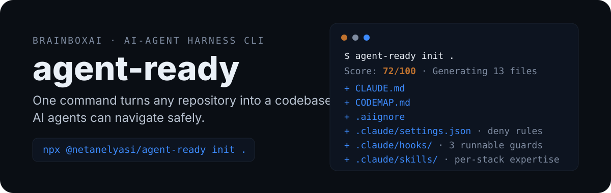
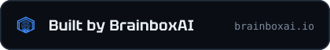

<p align="center">
  
</p>

<p align="center">
  <a href="https://github.com/Brainboxai-IL/agent-ready/actions/workflows/ci.yml"></a>
  
  
  
  
</p>

<p align="center">
  <a href="#quick-start">Quick Start</a> ·
  <a href="#what-it-generates">What it Generates</a> ·
  <a href="#how-it-works">How it Works</a> ·
  <a href="#safety-model">Safety</a> ·
  <a href="#cli-reference">CLI Reference</a> ·
  <a href="#development">Development</a>
</p>

AI agents perform best when a repository answers six questions: where to start searching, which files are generated noise, which commands are safe to run, which rules belong in always-loaded context, which expertise should load on demand, and what must never be touched without confirmation. `agent-ready` scans your project and turns those answers into files an agent can actually use:

```txt
$ npx @netanelyasi/agent-ready init .

Agent Ready: my-app
Score: 72/100
Languages: TypeScript, Python
Frameworks: Next.js, React
Databases/tools: Supabase
Monorepo: yes (Turborepo, pnpm workspaces)

Generating 14 files:
- created: CLAUDE.md
- created: CODEMAP.md
- created: .aiignore
- created: .claude/settings.json
- created: .claude/hooks/prevent-destructive.mjs
- created: .claude/hooks/protect-generated.mjs
- created: .claude/hooks/suggest-validation.mjs
- created: .claude/skills/codebase-navigation/SKILL.md
- created: .claude/skills/nextjs-hydration/SKILL.md
- created: .claude/skills/supabase-debugging/SKILL.md
- created: apps/web/CLAUDE.md
- created: packages/db/CLAUDE.md
...
```

It is designed for real repositories — small apps, legacy codebases, monorepos, or projects that need a clean onboarding layer for Claude Code and other agentic coding tools. It scans directly from disk: no uploads, no embeddings, no remote index.

> [!WARNING]
> `agent-ready` is an **experimental early preview**. Detection is heuristic; review generated files before committing.

## Quick Start

```bash
# score a project without writing anything
npx @netanelyasi/agent-ready analyze .

# preview what would be generated (add --verbose to see contents)
npx @netanelyasi/agent-ready init . --dry-run

# generate the harness
npx @netanelyasi/agent-ready init .
```

Existing files are never overwritten by default — `agent-ready` writes `CLAUDE.md.agent-ready-proposed` next to them for manual review, or use `--force` to overwrite intentionally.

To install globally: `npm install -g @netanelyasi/agent-ready` (the binary is `agent-ready`).

> [!NOTE]
> Run `agent-ready init` from your own terminal, not from inside an autonomous coding agent. It writes agent harness files (`CLAUDE.md`, `.claude/settings.json`, hooks) which agent security classifiers correctly treat as self-modification.

## What it Generates

| File | Job |
| --- | --- |
| `CLAUDE.md` | Lean root guide: project snapshot, stack, env var names, validation commands, operating rules |
| `CODEMAP.md` | Navigation map: entry points, central files by import usage, import graph, directory purpose |
| `.aiignore` | Noise exclusions: `node_modules/`, `dist/`, `coverage/`, `**/*.generated.*`, ... |
| `.claude/settings.json` | Versioned deny rules wiring three runnable safety hooks |
| `.claude/hooks/*.mjs` | `prevent-destructive` (blocks `rm -rf`, `git reset --hard`, force-push), `protect-generated` (blocks edits to generated/noisy paths), `suggest-validation` (reminds which command to run after edits) |
| `.claude/skills/*/SKILL.md` | On-demand expertise, generated only on matching signals: `codebase-navigation`, `validation`, `nextjs-hydration`, `supabase-debugging`, `rtl-ui`, `deployment` |
| `.agent-ready/report.md` | Readiness score with strengths, gaps, and warnings |
| `.agent-ready/recommendations.md` | LSP, MCP, hook, and maintenance suggestions |
| `<workspace>/CLAUDE.md` | Local guide per declared monorepo workspace: local commands and navigation rules |

The root `CLAUDE.md` stays intentionally short — task-specific expertise goes into skills that load on demand instead of bloating every session.

## How it Works

The scanner reads manifests, lockfiles, configs, and source files, then detects:

| Area | Signals |
| --- | --- |
| JavaScript/TypeScript | `package.json`, lockfiles, scripts, TS/JS files |
| Frameworks | Next.js, React, Vue, Nuxt, SvelteKit, Vite, Express, NestJS |
| Other languages | Python, PHP, Java, C#, Go, Rust, C/C++ |
| Databases | Supabase, Prisma, Drizzle, PostgreSQL, MySQL, MongoDB |
| Monorepos | Turborepo, Nx, pnpm workspaces, package `workspaces` |
| Deployment | Docker, GitHub Actions, Vercel, Netlify, Cloudflare Workers |
| UI traits | Hebrew/RTL detection |
| Project context | README description, required env vars from `.env.example` |
| Validation | build, test, lint, typecheck, format scripts |

On top of that it builds a lightweight static code map for JS/TS, Python, Go, and Rust: manifest-declared entry points (`bin`, console scripts, `[[bin]]`), import relationships resolved per language (including TS imported via runtime `.js` specifiers, Python relative modules, `go.mod` paths, and Rust `mod`/`crate::` declarations), central files ranked by inbound imports, and external packages with standard libraries filtered out.

Everything feeds an **Agent Readiness Score**. The score does not give full credit for files `agent-ready` generated itself — generated files become readiness signal only after maintainers review and customize them.

## Safety Model

- **No overwrite by default** — existing files produce `*.agent-ready-proposed`.
- **Fails loudly on bad input** — a nonexistent target path, a file passed as target, or a typo'd flag is an error, never a silent partial run.
- **Runnable hooks, not documentation** — safety checks are wired in `.claude/settings.json` and the generated hooks are executed in this repo's test suite: syntax-checked and fed real stdin, asserting deny decisions for `rm -rf`, `git reset --hard`, force-pushes, and edits to generated paths.
- **Workspace-scoped generation** — per-package `CLAUDE.md` files are written only into declared workspaces, never into stray `examples/` or fixture directories.
- **No self-inflating score** — generated files are not counted as maintainer-authored readiness.

The test suite (32 tests) also covers degenerate repositories — empty dirs, malformed manifests, binary and multi-megabyte source files — and verifies that repeated `init --force` runs are byte-for-byte stable. CI runs the suite on Ubuntu and Windows across Node 20 and 22, plus a gate that fails if the committed `dist/` drifts from a fresh build.

## Limitations

- Detection is heuristic: custom frameworks, unusual scripts, and non-standard layouts can be missed.
- Generated files are a strong starting point, not a replacement for maintainer review.
- Import graphs cover JS/TS plus first-pass Python/Go/Rust; PHP/Java/C#/C/C++ are detected but not yet mapped.
- No deep semantic analysis of CI workflows or architecture docs yet.
- No code upload, no remote AI calls. Not affiliated with or endorsed by Anthropic.

## CLI Reference

| Command | Effect |
| --- | --- |
| `agent-ready analyze [path]` | Scan and print the readiness summary; writes nothing |
| `agent-ready init [path]` | Scan and generate the harness |
| `agent-ready init [path] --dry-run` | List the files that would be generated |
| `agent-ready init [path] --dry-run --verbose` | Also print each file's contents |
| `agent-ready init [path] --force` | Overwrite existing files instead of proposing |

Unknown flags are rejected with an error — a typo like `--dryrun` will never silently trigger a real write run.

## Development

```bash
npm install
npm run dev -- analyze .   # run from source
npm run check              # type-check
npm test                   # build + 32 tests
```

Before opening a pull request: run `npm run check` and `npm test`, try the CLI on at least one real project with `--dry-run`, and keep generated root context lean — task-specific expertise belongs in skills.

## Roadmap

- deeper config/CI-workflow analysis
- richer monorepo workspace detection
- generated `CONTRIBUTING.md` and `SECURITY.md` templates
- optional AI-assisted repository summary mode
- plugin/export presets for Claude Code, Cursor, Codex, and other agents
- CI mode failing builds when readiness drops below a threshold

## Acknowledgements

`agent-ready` was created after studying Anthropic's article [How Claude Code works in large codebases](https://claude.com/blog/how-claude-code-works-in-large-codebases-best-practices-and-where-to-start), and turns that guidance — lean context files, codebase maps, skills, hooks, scoped noise — into a repeatable CLI workflow. This project is independent and is not affiliated with or endorsed by Anthropic.

## License

MIT © BrainboxAI

<p align="center">
  
</p>
